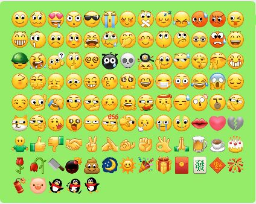

# wechat-emoji-dict

将所有微信表情导出成如下字典文件:

- GBoard(全拼): [wechat-emoji-gboard-pinyin.zip](https://github.com/ipcjs/wechat-emoji-dict/releases/download/v1.1.0/wechat-emoji-gboard-pinyin.zip)
- GBoard(小鹤双拼): [wechat-emoji-gboard-flypy.zip](https://github.com/ipcjs/wechat-emoji-dict/releases/download/v1.1.0/wechat-emoji-gboard-flypy.zip)
- Rime/小狼毫: [wechat-emoji.dict.yaml](https://github.com/ipcjs/wechat-emoji-dict/releases/download/v1.1.0/wechat-emoji.dict.yaml)

## 图示

